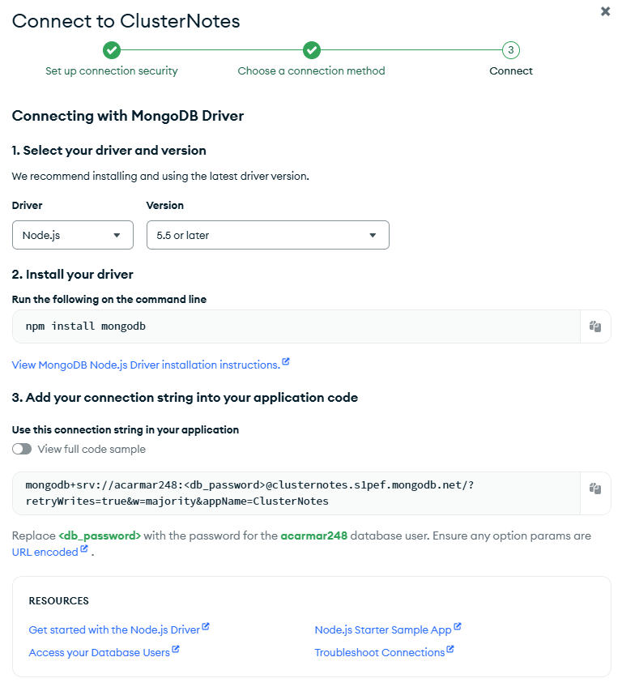
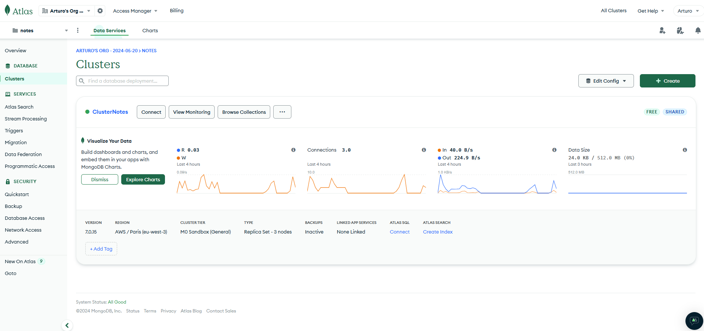
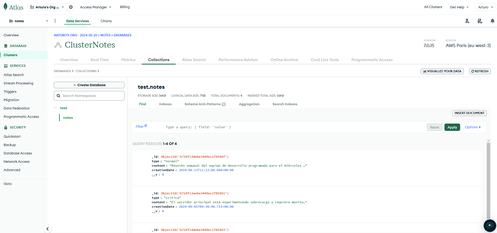
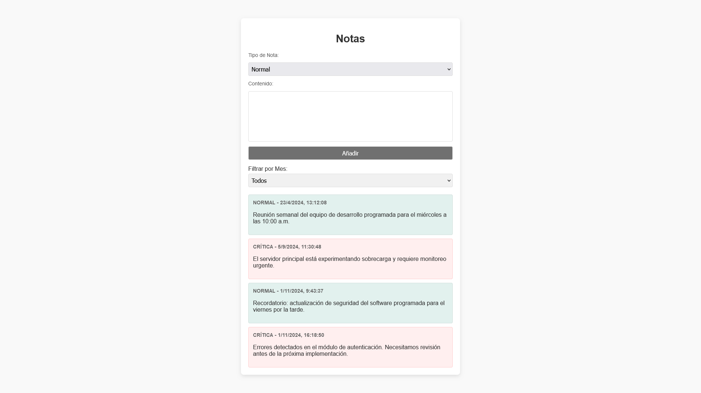

# Proyecto de Gestión de Notas - API REST y Cliente Web

Este proyecto es una aplicación de gestión de notas construida utilizando una API REST en Node.js con Express y una interfaz web en JavaScript. La aplicación permite crear, listar y filtrar notas almacenadas en una base de datos MongoDB mediante Mongoose, que se clasifican por tipo (normal o crítica) y se filtran por fecha (mes) de creación.

## Tabla de Contenidos
1. [Descripción del Proyecto](#descripción-del-proyecto)
2. [Arquitectura del Proyecto](#arquitectura-del-proyecto)
3. [Detalles del Código](#detalles-del-código)
   - [Servidor: index.js](#servidor-indexjs)
   - [Modelo de Nota: Mongoose](#modelo-de-nota-mongoose)
   - [Interfaz Web: Cliente](#interfaz-web-cliente)
   - [Módulo de Comunicación: NotesHandler](#módulo-de-comunicación-noteshandler)
   - [Módulo de Consumo: NotesConsumer](#módulo-de-consumo-notesconsumer)
4. [Rutas de la API](#rutas-de-la-api)
5. [Conexión a MongoDB mediante Atlas](#conexión-a-mongodb-mediante-atlas)
6. [Aspecto final de la web](#aspecto-final-de-la-web)

---

## Descripción del Proyecto

La aplicación de gestión de notas permite realizar las siguientes operaciones:
- **Crear notas**: A través de una solicitud POST, se agregan notas con información de tipo (normal o crítica) y contenido.
- **Obtener notas**: A través de una solicitud GET, se pueden listar todas las notas, y filtrar notas por mes de creación.
- **Filtrar por mes**: La interfaz web permite seleccionar el mes de creación para ver solo las notas creadas en dicho período.

## Arquitectura del Proyecto

El proyecto consta de los siguientes componentes:

1. **API REST**: Desarrollada en Node.js y Express, permite manejar solicitudes HTTP para manipular notas (GET y POST).
2. **Base de datos MongoDB**: Utilizando Mongoose, las notas se almacenan de forma persistente.
3. **Cliente Web**: Desarrollado en JavaScript, permite a los usuarios interactuar con las notas a través de una interfaz sencilla.
4. **Componentes del Cliente**:
   - `NotesHandler.js`: Módulo que gestiona las solicitudes hacia la API.
   - `NotesConsumer.js`: Módulo que muestra y organiza las notas en la interfaz web.

## Detalles del Código

### Servidor: index.js

El servidor se configura con Node.js y Express, escuchando en el puerto 3000. Este archivo inicializa la conexión con MongoDB, define el modelo de datos de la nota, y proporciona dos rutas principales para el manejo de notas.

#### Configuración y Conexión a MongoDB

```javascript
const mongoURI = 'mongodb+srv://<usuario>:<contraseña>@<nombre_cluster>.mongodb.net/<nombre_bd>?retryWrites=true&w=majority';
mongoose.connect(mongoURI)
    .then(() => console.log('Conectado a la base de datos MongoDB'))
    .catch(err => console.error('Error de conexión a MongoDB:', err));
```

#### Rutas API

**Obtener notas (GET /notes):** Devuelve todas las notas, con la opción de filtrado por mes.

```javascript
app.get('/notes', async (req, res) => {
    try {
        const { month } = req.query;
        let filter = {};

        if (month) {
            const start = new Date(new Date().getFullYear(), month - 1, 1);s
            const end = new Date(new Date().getFullYear(), month, 1);
            filter.creationDate = { $gte: start, $lt: end };
        }

        const notes = await Note.find(filter);
        res.json(notes);
    } catch (error) {
        res.status(500).json({ error: 'Error al obtener las notas' });
    }
});
```

**Añadir una nota (POST /notes):** Añade una nueva nota a la base de datos MongoDB.

```javascript
app.post('/notes', async (req, res) => {
    const { type, content } = req.body;

    try {
        const newNote = new Note({ type, content });
        await newNote.save();
        res.status(201).json(newNote);
    } catch (error) {
        res.status(500).json({ error: 'Error al agregar la nota' });
    }
});
```

### Modelo de Nota: Mongoose

El modelo de nota en MongoDB se define con Mongoose y contiene los campos `type` (String), `content` (String) y `creationDate` (Date), siendo este último la fecha de creación por defecto.

```javascript
const noteSchema = new mongoose.Schema({
    type: { type: String, required: true },
    content: { type: String, required: true },
    creationDate: { type: Date, default: Date.now }
});
const Note = mongoose.model('Note', noteSchema);
```

### Interfaz Web: Cliente

La interfaz web, definida en index.html, contiene un formulario para crear notas, un filtro de selección de mes y un contenedor para mostrar las notas.

```html
<!DOCTYPE html>
<html lang="es">
<head>
    <title>Notas</title>
    <link rel="stylesheet" href="./assets/styles.css">
</head>
<body>
    <!-- Formulario y área de filtrado y visualización de notas -->
</body>
<script type="module" src="index.js"></script>
</html>
```

### Módulo de Comunicación: NotesHandler

`NotesHandler.js` es responsable de la comunicación con la API. Implementa dos métodos:

1. **getAllNotes:** Realiza una solicitud GET para obtener las notas (opcionalmente filtradas por mes).

2. **addNote:** Realiza una solicitud POST para añadir una nueva nota.

```javascript
export class NotesHandler {
    constructor(url) { /* Constructor */ }
    getAllNotes(month, onSuccessCallback, onErrorCallback) { /* Obtener notas */ }
    addNote(noteData, onSuccessCallback, onErrorCallback) { /* Añadir nota */ }
}
```

### Módulo de Consumo: NotesConsumer

`NotesConsumer.js` es responsable de recibir las notas de `NotesHandler` y mostrarlas en el DOM del cliente web, con un estilo diferenciado según el tipo de nota.

```javascript
export class NotesConsumer {
    static consume(notes, element) { /* Mostrar todas las notas */ }
    static addSingleNote(note, element) { /* Mostrar una sola nota */ }
}
```

## Rutas de la API

### GET /notes

- **Descripción:** Obtiene todas las notas almacenadas, con opción de filtrado por mes.
- **Parámetros de Consulta:**  
    - `month` (opcional, número): Filtra notas por el mes de creación (1 para enero, 2 para febrero, etc.).
- **Respuesta:**
    - Cuerpo: Lista de objetos JSON que representan cada nota.

**Ejemplo de Respuesta:**

```json
[
    {
        "_id": "60b8c4bf7f1b2c001c8e4f2f",
        "type": "normal",
        "content": "Ejemplo de nota",
        "creationDate": "2023-05-31T21:10:15.158Z"
    }
]
```

### POST /notes

- **Descripción:** Añade una nueva nota a la base de datos.

- **Cuerpo de la Solicitud** (JSON):
    - `type` (string): Tipo de nota, puede ser `normal` o `critica`.
    - `content` (string): Contenido de la nota.

- **Respuesta:**
    - Código: 201 (Creado)
    - Cuerpo: Objeto JSON que representa la nota creada.

**Ejemplo de Solicitud:**

```json
{
    "type": "critica",
    "content": "Esta es una nota crítica."
}
```

## Conexión a MongoDB mediante Atlas

Para almacenar las notas en MongoDB mediante MongoDB Atlas, se deben seguir estos pasos:

1. **Crear una cuenta en MongoDB Atlas:** https://www.mongodb.com/cloud/atlas.

2. **Crear un nuevo clúster:**
    - En el panel de MongoDB Atlas, seleccionar la opción de crear un clúster.
    - Seguir las instrucciones para elegir la configuración.

3. **Configurar el acceso:**
    - Una vez creado el clúster, crear un usuario y contraseña en la sección **Database Access**.

4. **Obtener la URI de conexión:**
    - En al panel del clúster, seleccionar **Connect > Connect your application**.
    - Copiar la URI de conexión e insertala en el código del servidor, reemplazando `<db_password>` por los valores configurados.

    

Con estos pasos, la aplicación queda conectada a MongoDB Atlas y lista para almacenar notas de forma persistente en la nube.





## Aspecto final de la web

